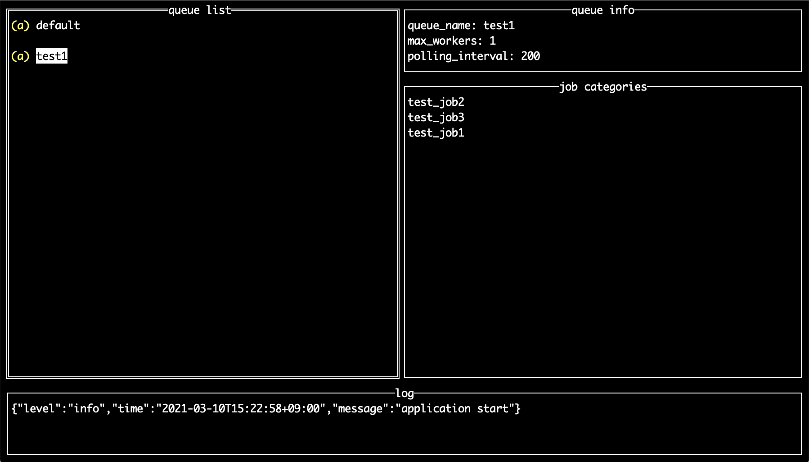

# ennichi

fireworq TUI management console application



## これは何？

fireworq管理用のTUIアプリケーションです。

## 何ができるの？

現在以下の機能を実装しています。

- キュー一覧の表示 (queue list)
- キュー設定の表示 (queue info)
- キューのジョブルーティング設定の表示 (job categories)
- キューの新規作成
- キューのジョブルーティング設定の新規作成

## インストール方法

```shell
go get github.com/stk132/ennichi
```

## 使い方

fireworqのエンドポイントを指定して起動します。

```shell
ennichi --host=http://yourfireworqhost
```

以下のキーバインドが設定されています。

- ctrl + q: キュー一覧にフォーカス
- ctrl + l: ログウィンドウにフォーカス
- ctrl + n: 新規キュー作成フォームに遷移
- ctrl + j: 新規ジョブルーティング設定作成フォームに遷移

キュー一覧にフォーカスしている際のキーバインド

- r: キュー一覧を更新
- enter: 選択中のキューの設定情報とジョブルーティング情報がそれぞれqueue infoとjob categoriesに表示

## TODO:

- キューの削除機能
- ジョブルーティング設定の削除機能
- キュー設定の更新機能
